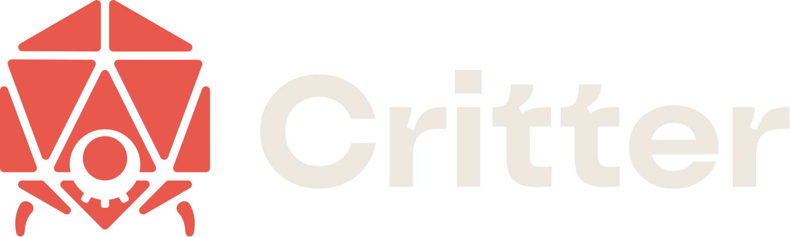
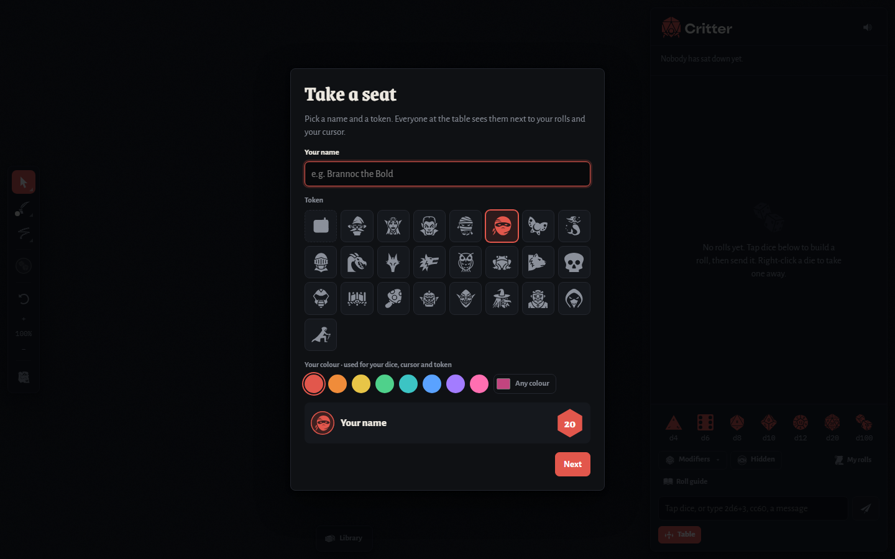

<p align="center">
  
</p>

<p align="center"><b>A free virtual tabletop for your group, in the browser or on Windows.</b></p>

<p align="center">
  <a href="https://critter.poly-chrome.cc">Play in your browser</a> ·
  <a href="https://booskers.github.io/crittervtt/">Website</a> ·
  <a href="https://github.com/booskers/crittervtt/releases/latest">Download for Windows</a>
</p>



## Critter

Critter is a virtual tabletop that opens in a browser. Share a lobby code and your group sits down at the same table, with the same map and dice and every roll as it happens.

- **Battle map** with tokens, drawing tools and live cursors.
- **Dice** from d4 to d100, with modifiers, hidden rolls and typed rolls like `2d6+3`.
- **Character sheets and items**, plus D&D Beyond import.
- **Rules compendium** for D&D 5e, Pathfinder 2e, Daggerheart, Blades in the Dark and Fate.
- **Autosaves and Rewind** on the server, and the GM's own saves folder.
- Runs in any modern browser, on phones, or as a Windows app.

## Critter Sounds


The companion app for whoever runs the music: playlists, sound pads and soundscapes, streamed live to every player. It has its own repository, site and downloads: **[github.com/booskers/critter-sounds](https://github.com/booskers/critter-sounds)** · [booskers.github.io/critter-sounds](https://booskers.github.io/critter-sounds/). It uses Critter's music effects (the `MUSICFX` block of `critboard.html`) and Homebase client, which its build copies in.

## What's in this repository

| Folder | What it is |
|---|---|
| [`critboard/`](critboard) | The Critter page itself (`critboard.html`) and the rules compendium data (`srd/`). |
| [`critboard-desktop/app`](critboard-desktop/app) | The Critter Windows app (Electron). |
| [`critboard-desktop/homebase-cloudflare`](critboard-desktop/homebase-cloudflare) | Homebase, the server, as a Cloudflare Worker (free plan). |
| [`critboard-desktop/homebase-server`](critboard-desktop/homebase-server) | Homebase as a self-hosted Node server. |
| [`docs/`](docs) | This project's website (GitHub Pages). |

Folder and package names still say *critboard*, Critter's earlier name; they're kept so existing tables and installs keep working.

Setup, building, the Homebase protocol and the full feature notes are in **[critboard-desktop/README.md](critboard-desktop/README.md)**.

### Quick start

```bash
cd critboard-desktop/app
npm install
npm start
```

## License

Critter VTT, Critter Sounds and Critter Notes are released under the [MIT License](LICENSE): use, change and share them freely, as long as you keep the copyright notice and give credit. Made with love by booskers / Polychrome. What changed in each version: [CHANGELOG.md](CHANGELOG.md).

The third-party content below keeps its own license.

## Credits

- Icons from [game-icons.net](https://game-icons.net), CC BY 3.0.
- Online library tracks keep their own licenses, shown with each track.
- Uses [yt-dlp](https://github.com/yt-dlp/yt-dlp), downloaded on request.
- Rules compendium content comes from each game's published SRD under its own license.
